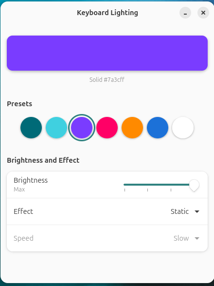

# Keyboard Lighting

**An Armoury Crate replacement for the one thing it was actually needed for: the keyboard backlight.**


ASUS ships Armoury Crate for Windows only. Install Linux on a TUF laptop and the
RGB keyboard becomes dead weight — stuck on whatever colour Windows left behind,
with no way to change it and Fn keys that do nothing.

This is a single small GTK4 app that gives it back: **set the colour, brightness
and effect, keep the hotkeys working, and get out of the way.** That's the whole
scope. No fan curves, no performance profiles, no background daemon, no tray
icon, no telemetry, nothing running when the window is closed.

<!-- Add a screenshot: PrtSc the window, save as share/screenshot.png, then uncomment:

-->

---

## Contents

- [Requirements](#requirements)
- [Install](#install)
- [Using it](#using-it)
- [How it talks to the hardware](#how-it-talks-to-the-hardware)
- [Why it's built this way](#why-its-built-this-way)
- [Troubleshooting](#troubleshooting)
- [Verifying an install](#verifying-an-install)
- [Uninstall](#uninstall)
- [Limitations](#limitations)
- [Layout](#layout)

---

## Requirements

**Hardware** — an ASUS laptop whose `asus-nb-wmi` driver exposes single-zone RGB:

```sh
ls /sys/class/leds/asus::kbd_backlight/kbd_rgb_mode   # must exist
```

If that file isn't there, this app cannot help you and `install.sh` will say so
and stop rather than install half of itself.

**Software** — GTK4 and libadwaita, both already present on a stock Ubuntu GNOME
install. If anything's missing the installer prints the exact `apt` line:

```sh
sudo apt install python3-gi gir1.2-gtk-4.0 gir1.2-adw-1 libnotify-bin
```

**Developed and tested on:**

| | |
|---|---|
| Laptop | ASUS TUF Gaming A15 FA506IC (single-zone RGB) |
| OS | Ubuntu 26.04 LTS, kernel 7.0.0-28-generic |
| Desktop | GNOME Shell 50.1 (Wayland) |
| Toolkit | GTK4 + libadwaita 1.9 |

Other ASUS models with the same sysfs interface should work. Non-GNOME desktops
work too — you just bind the hotkeys yourself (the installer says so and skips
that step instead of failing).

## Install

```sh
./install.sh
```

Asks for your sudo password **once**, asks whether you want a Desktop shortcut,
reports every step, and **opens the app when it's finished** so you can see what
you just installed. Idempotent — re-run it any time to update after editing the
source.

```sh
./install.sh --check          # verify an existing install, change nothing
./install.sh --shortcut       # add the Desktop shortcut without asking
./install.sh --no-shortcut    # skip it without asking
./install.sh --no-launch      # don't open the app at the end
```

The flags exist so an unattended run never blocks on a prompt — the question is
only asked when there's a real terminal attached, and defaults to *no* otherwise.
The app-grid entry is always installed; the Desktop shortcut is the optional
extra. On GNOME the shortcut is marked trusted, without which double-clicking a
`.desktop` file just opens it in a text editor.

<details>
<summary>What it puts where</summary>

| Path | Owner | Purpose |
|---|---|---|
| `~/.local/bin/kbdrgb-gui` | you | the app |
| `~/.local/bin/kbdrgb` | you | one-shot CLI |
| `~/.local/bin/kbdrgb-cycle` | you | effect stepper, called by the hotkeys |
| `/usr/local/bin/kbdrgb-write` | **root** | the only privileged piece |
| `/etc/sudoers.d/kbdrgb` | **root** | NOPASSWD for exactly that one binary |
| `~/.local/share/applications/kbdrgb.desktop` | you | app-grid launcher |
| `~/Desktop/kbdrgb.desktop` | you | *optional* — only if you say yes |
| GNOME `custom-keybindings` | you | `Super+Alt+Left` / `Super+Alt+Right` |
| `~/.local/state/kbdrgb/state` | you | last colour/effect (created on first run) |

The installer rewrites the launcher's `Exec=` to the installed copy in
`~/.local/bin`, never to this source tree — the source may sit on a drive that
isn't mounted at login, which would break the launcher on every boot.

</details>

Then launch **Keyboard Lighting** from the app grid, or run `kbdrgb-gui`.

## Using it

### The window

Everything is on one page and every change applies immediately — no Apply
button, no tabs, no wizard.

| Control | Behaviour |
|---|---|
| **Colour strip** | Click it. The preview *is* the picker. |
| **Presets** | Teal, Ice, Violet, Magenta, Amber, Azure, White. Whichever matches the live colour is ringed. |
| **Brightness** | Off / Low / Medium / Max. At Off the preview dims — it never shows a glow that isn't on the keyboard. |
| **Effect** | Static, Breathing, Rainbow cycle, Strobe. |
| **Speed** | Greys out under Static. Colour greys out under Rainbow cycle. Neither means anything there, so neither pretends to. |
| **Escape** | Closes the window. |

If a hotkey or an Fn key changes something while the window is open, the window
follows along rather than going stale.

### Hotkeys

| Keys | Action |
|---|---|
| `Super+Alt+Right` | next effect |
| `Super+Alt+Left` | previous effect |

Each shows a desktop notification that replaces the previous one instead of
stacking a banner per keypress.

### CLI

For scripts, `.xprofile`, or a window-manager keybind:

```sh
kbdrgb 006a77                 # solid teal
kbdrgb ff0066 breathe 1       # magenta, breathing, medium speed
kbdrgb ffffff cycle           # rainbow (colour argument is ignored by the hardware)
kbdrgb-cycle next             # step the effect forward
```

`kbdrgb HEX [static|breathe|cycle|strobe] [speed 0-2]`

No password prompt: it hands off to the same `kbdrgb-write` helper the GUI uses
rather than writing sysfs itself, so there's one copy of the validation and one
`save=0`/`save=1` pair. It also updates the state file, so a change made from the
CLI shows up correctly in the GUI and the hotkeys instead of leaving them stale.

## How it talks to the hardware

Two *separate* kernel interfaces, and that split explains the whole design.

**Colour and effect — `kbd_rgb_mode`**

```
/sys/class/leds/asus::kbd_backlight/kbd_rgb_mode    --w-------  root only
```

Root-only and **write-only**. Two consequences run through everything else:

- *Root-only* is why `kbdrgb-write` exists. The GUI never runs as root. It shells
  out to a 19-line helper that validates every argument and writes sysfs, and
  only that helper gets a password-free sudo rule.
- *Write-only* is why there's a state file. The current effect genuinely cannot be
  read back from the kernel — nothing can query it. So
  `~/.local/state/kbdrgb/state` is the only record of what's set, in a 5-field
  `mode speed r g b` format shared between the GUI and `kbdrgb-cycle`.

Each write goes twice, `save=0` then `save=1`, so the setting both applies
instantly and survives a reboot.

**Brightness — a normal LED attribute**

```
/sys/class/leds/asus::kbd_backlight/brightness       -rw-r--r--  0..3
```

Needs no helper and no sudo at all. logind's `SetBrightness` writes it for the
active session over D-Bus, and polkit permits that without a password:

```
org.freedesktop.login1.Session.SetBrightness("leds", "asus::kbd_backlight", 2)
```

It's also readable, which is why brightness is the one value the app can sync
from the hardware instead of remembering.

## Why it's built this way

**One window, not three dialogs.** The first version was a mode list, then a
colour wheel, then a speed prompt — three modal steps to change one colour. All
of it fits on one page with a live preview, so it's one page.

**A 19-line root helper instead of a root GUI.** Running a whole GTK app as root
to poke one sysfs file is a bad trade. The privileged surface is one small script
that validates its input, in root-owned `/usr/local/bin` where you can't rewrite
it. The sudoers rule names that exact path — pointing such a rule at anything
under `$HOME` would hand root to anyone who can write there.

**`visudo -c` before the sudoers file is installed.** A malformed file in
`/etc/sudoers.d/` breaks `sudo` completely, and repairing it needs `sudo`. That's
a genuine lockout, so the installer validates a tempfile first and aborts
without touching the system if it doesn't parse.

**`Super+Alt+Left/Right`, not `Fn+Left/Right`.** On this laptop the Fn+arrow
combinations never reach Linux at all — they're consumed in firmware and emit no
keycode, which `tools/kbdrgb-probe` is how you establish. Super+Alt+arrow is
unbound in stock GNOME, so it collides with neither window snapping
(`Super+Left/Right`) nor workspace switching (`Ctrl+Alt+Left/Right`).

**Two ceilings, both marked in the source rather than hidden.** Brightness is
polled once a second because sysfs attributes don't support inotify (they use
`poll()`/`sysfs_notify`; the upgrade path is a GSource on `brightness_hw_changed`).
And an external effect change makes the GUI re-send an identical colour to the
hardware — a redundant write, not a wrong one.

## Troubleshooting

| Symptom | Cause and fix |
|---|---|
| `install.sh` stops at "asus-nb-wmi single-zone RGB present" | Driver isn't loaded or the model differs. Check `ls /sys/class/leds/`. Without `kbd_rgb_mode` there's nothing to drive. |
| Colour won't change, window shows **Write failed** | The sudoers rule isn't active. Run `./install.sh --check`. |
| A password prompt appears when changing colour | Same cause — `/etc/sudoers.d/kbdrgb` is missing or not `0440 root:root`. Re-run `./install.sh`. |
| Hotkeys do nothing | Not a GNOME session, or the bindings didn't apply. Check: `gsettings get org.gnome.settings-daemon.plugins.media-keys custom-keybindings` — it should list two `kbdrgb-*` paths. |
| Brightness slider does nothing | Not in an active seat session. Verify with `loginctl` that your session is `active`. |
| Effect resets after reboot | Expected for the *effect*; the colour persists via `save=1`. The state file restores the rest on next launch. |
| Launcher missing from the app grid | `update-desktop-database ~/.local/share/applications`, then log out and back in. |
| Desktop shortcut opens a text editor instead of running | GNOME doesn't trust it. `gio set ~/Desktop/kbdrgb.desktop metadata::trusted true`, or just re-run `./install.sh --shortcut`. |
| Nothing opens at the end of the install | No `$DISPLAY`/`$WAYLAND_DISPLAY` — an SSH or headless run says so and skips launching rather than failing. |
| App-grid icon vanishes after a reboot | The launcher points at `~/.local/bin`, so this shouldn't happen — but if you ran the app straight from this source tree, note it lives on a drive that isn't mounted at login. |

## Verifying an install

```sh
./install.sh --check     # checks every installed piece, changes nothing
kbdrgb-gui --selftest    # exercises the hardware paths, no display needed
```

`--selftest` needs no test framework and no X/Wayland display. It sets
brightness across its full range and reads each value back from sysfs, checks the
label mapping, round-trips the state file in the exact 5-field format
`kbdrgb-cycle` parses, and asserts that a corrupt state file falls back to
defaults instead of crashing. It restores everything it touched. `install.sh`
runs it as its last step.

## Uninstall

```sh
./uninstall.sh           # keeps your saved colour
./uninstall.sh --purge   # removes that too
```

Closes the app if it's open, then reverses the sudoers rule, the GNOME hotkeys
and the Desktop shortcut as well as the files — the pieces a plain `rm` would
leave behind. The keyboard keeps whatever colour was last set until reboot.

## Limitations

- **Single-zone only.** Per-key and 4-zone TUF/ROG models need `kbd_rgb_state`
  and a different write format.
- **Lighting only.** No fan curves, no performance profiles, no Aura sync. Those
  are what [asusctl](https://gitlab.com/asus-linux/asusctl) is for — this exists
  for machines where asusctl is more than you want to install.
- **GNOME for the hotkey step.** Everything else is desktop-agnostic; on other
  desktops bind `kbdrgb-cycle next` / `prev` yourself.
- **Effect can't be read from hardware,** so if you change it with some other
  tool the state file goes stale and the arrows resume from the wrong place.

## Layout

```
.
├── install.sh              # idempotent installer; --check verifies without changing
├── uninstall.sh            # reverses sudoers + hotkeys too, not just files
├── bin/
│   ├── kbdrgb-gui          # the GTK4/libadwaita app; --selftest
│   ├── kbdrgb              # one-shot CLI
│   └── kbdrgb-cycle        # effect stepper the hotkeys call
├── root/
│   ├── kbdrgb-write        # the only privileged code: validates, writes sysfs
│   └── kbdrgb.sudoers      # NOPASSWD rule for exactly that binary
├── share/
│   └── kbdrgb.desktop      # app-grid launcher
└── tools/
    └── kbdrgb-probe        # diagnostic: prints raw keycodes. Not installed.
```

Every file starts with a comment saying what it is and why it exists.

## License

MIT — see [LICENSE](LICENSE). Do what you like with it.

---

Built for one laptop that needed it. If it works on yours, good.
