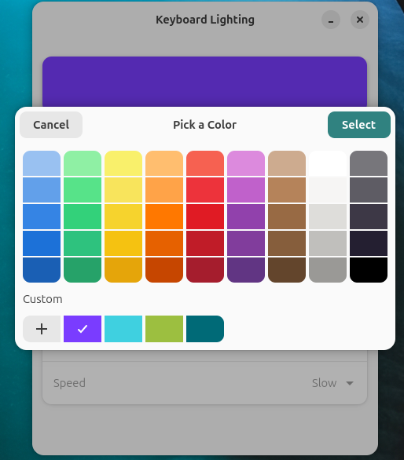

# I built a keyboard RGB app for my laptop and it froze the whole machine. Twice.

I have an ASUS TUF Gaming A15. It has an RGB keyboard, and the software ASUS ships to control it, Armoury Crate, only runs on Windows. I run Ubuntu. So the keyboard sat on whatever colour Windows left it on the last time I booted into it.

I wanted a small app to change it. What I got instead was two hard freezes at 4 in the morning, a corrupted filesystem, and a lesson about firmware that I would not have learned any other way.

Upfront, since it matters for how you read the rest: I built this with Claude Code, not by hand. The AI wrote most of the lines. It also wrote the bug that froze my laptop, and it did not catch it, because nothing in the code looks wrong. Finding that took reading logs at 4am and understanding what the hardware was actually being asked to do. That part does not come from a prompt.

This is the whole story.

---

## First: the kernel already does the hard part

Before writing anything I went looking for how other tools do it. The usual answers are `asusctl` (Rust, has to be built from source, not in apt) and OpenRGB (big, general purpose). Both felt heavy for "I want to set a colour."

Then I found this file:

```
/sys/devices/platform/asus-nb-wmi/leds/asus::kbd_backlight/kbd_rgb_mode
```

That is the kernel's `asus-nb-wmi` driver exposing the keyboard directly. No daemon, no extra package. It was already on my machine.

The format is six space-separated integers. I confirmed the order by reading the file next to it:

```bash
$ cat kbd_rgb_mode_index
cmd mode red green blue speed
```

So:

- `cmd` — 0 means apply now, 1 means also save to firmware
- `mode` — 0 static, 1 breathing, 2 rainbow, 3 strobe
- `red` `green` `blue` — 0 to 255
- `speed` — 0 slow, 1 medium, 2 fast

Setting the keyboard to teal is one line:

```bash
echo "1 0 0 106 119 0" | sudo tee /sys/devices/.../kbd_rgb_mode
```

That is it. That is the entire hardware interface. Everything else in this post is about the constraints around that one line.

One thing worth knowing early: this laptop has **single-zone** RGB. The whole keyboard is one colour. Per-key lighting is not a software limitation here, the hardware physically cannot do it. That also means Armoury Crate's wave and ripple effects were never on the table. There are exactly four effects because the driver exposes four.

---

## The three constraints that shaped the app

I did not sit down and design an architecture. The design came out of three things the kernel would not let me do.

**1. The file is root-only.**

A GUI should not run as root. Ever. So the app cannot write sysfs itself.

My answer was to split it: a tiny root-owned shell script that does nothing but validate numbers and write the file, and a `sudoers` rule that lets my user run that one script without a password.

```
# /etc/sudoers.d/kbdrgb
avinash ALL=(root) NOPASSWD: /usr/local/bin/kbdrgb-write
```

The important detail is *where* that script lives. It is in `/usr/local/bin`, owned by root, which my user cannot edit. If I had put it in my home folder, I could rewrite the script to say anything and run it as root without a password. That is not a colour picker anymore, that is a root escalation on my own machine. Same rule applies to anyone copying this pattern: never point a NOPASSWD rule at a file the user can write.

And since it runs as root, every argument gets checked before it reaches sysfs:

```sh
for v in "$1" "$2" "$3"; do
  case $v in ''|*[!0-9]*) echo "bad channel: $v" >&2; exit 1 ;; esac
  [ "$v" -le 255 ] || { echo "channel >255: $v" >&2; exit 1; }
done
```

**2. The file is write-only.**

You can write `kbd_rgb_mode`. You cannot read it back. `cat` gives you nothing useful. There is no way to ask the keyboard what colour it currently is.

That means the app has to remember for itself. I keep one small file with five numbers in it:

```
mode speed r g b
```

The GUI, the CLI and the cycle script all read and write that same file. If they did not, changing the colour from the terminal would leave the GUI showing a stale swatch. It is not elegant, but there is no other option when the hardware will not answer.

**3. Brightness is a completely separate thing.**

Colour is root-only. Brightness is not, it is a normal LED attribute, and there is a proper desktop API for it. logind will set it for the active session with no sudo at all:

```python
self._bus.call_sync("org.freedesktop.login1",
                    "/org/freedesktop/login1/session/auto",
                    "org.freedesktop.login1.Session", "SetBrightness",
                    GLib.Variant("(ssu)", ("leds", LED, level)),
                    None, Gio.DBusCallFlags.NONE, 2000, None)
```

Small trap that cost me an hour: use the D-Bus path `session/auto`, not `session/self`. `self` works when you launch from a terminal inside your graphical session and fails everywhere else, which is a fun kind of bug to chase.

The result is a single-window GTK4 app. Colour picker, preset swatches, brightness, effect, speed. No Apply button, changes go live as you drag.




---

## Then it crashed my laptop

The app worked. I was happy with it. I sat there clicking through presets to see how each one looked.

The machine died. Not a crash to a login screen, not a kernel panic on screen. Everything just stopped. Screen frozen, keyboard dead, power button held down was the only way out.

I got it back up, blamed something random, kept going. An hour later it happened again.

Then I opened the logs. Both crashes look like this:

```
04:27:03 ... kbdrgb-write
04:27:03 ... kbdrgb-write
04:27:04 ... kbdrgb-write
<end of file>
```

The log does not end with an error. It ends **mid-line**. The system did not decide to stop, it was cut off. And both times, the last thing in it is a burst of my own script.

There was collateral damage too. My NTFS data drive came back with the dirty bit set both times, because a frozen machine never gets to flush anything.

---

## What was actually wrong

Go back to the six integers. The first one is `cmd`.

- `cmd=0` — apply the colour now. Volatile, gone on reboot. Cheap.
- `cmd=1` — apply it **and write it to the EC's non-volatile store** so it survives a reboot.

The embedded controller's non-volatile store is EEPROM. `cmd=1` is a firmware write, going out through ASUS WMI.

My original script sent both, every single time:

```sh
echo "0 $m $1 $2 $3 $s" > "$LED"
echo "1 $m $1 $2 $3 $s" > "$LED"   # every call. every click.
```

So every preset click was an EEPROM write. Every tick of the colour slider was an EEPROM write. Dragging the picker across the wheel fired dozens of them in a second or two.

The EC is a small microcontroller. It is not built to take a firehose of firmware writes over WMI. Enough of them back to back and it stops responding, and when the EC hangs, the machine goes with it. That is why there is no panic and no error line. Nothing was left running to write one.

The uncomfortable part is that this bug was invisible while it was happening. Colours applied instantly, the app felt smooth, nothing logged a warning. `cmd=1` did not look like a cost. It looked like one more `echo`.

---

## The fix

Three changes, all inside the same script.

**Always `cmd=0`.** Applying the colour is cheap and safe to spam. The GUI can write as often as it likes.

**`cmd=1` only when it matters.** Only if the value actually changed, and at most once every 10 seconds. The last persist is tracked in a file under `/run`, which is tmpfs, so it clears itself every boot.

**Take a lock.** Two of these running at once puts a second WMI call into the EC while the first is still going. `flock` makes them queue.

```sh
exec 9>"$LOCK"
flock 9

# cmd=0 -> apply now, volatile. Cheap, safe to spam.
echo "0 $m $1 $2 $3 $s" > "$LED"

want="$m $1 $2 $3 $s"
now=$(date +%s)
last_t=0; last=""
[ -f "$STAMP" ] && IFS='|' read -r last_t last < "$STAMP" || true

if [ "$want" != "$last" ] && { [ "$force" = 1 ] || [ $((now - last_t)) -ge "$PERSIST_EVERY" ]; }; then
  echo "1 $m $1 $2 $3 $s" > "$LED"
  printf '%s|%s\n' "$now" "$want" > "$STAMP"
fi
```

There is one thing left to solve: if you never persist, your colour is gone after a reboot. So the helper takes a `--save` flag that skips the rate limit, and the GUI calls it exactly once, when the window closes:

```python
def on_close(self, *_):
    if self._pending:                 # a debounced change never made it out
        GLib.source_remove(self._pending)
    self._write(save=True)
    return False
```

One firmware write per session instead of one per click. The colour you left on screen is the colour that comes back.

I put the fix in the root helper rather than in the GUI on purpose. Three different things call it: the GUI, the CLI, and a cycle script. Fixing it in the GUI would have left the other two able to crash the machine. The helper is the one place they all pass through, so that is where the guard belongs.

---

## A test, because I do not trust myself to remember

This is the kind of bug that comes back. Someone (me, six months from now) reads `kbdrgb-write`, thinks "why is this so complicated", and simplifies it.

So the repo has a test that replays the exact burst from the crash logs, eight writes in about a second, and fails if any of them reach firmware:

```sh
# A burst like the one in the crash logs: 8 writes inside a couple of seconds.
for c in 255:138:0 255:0:102 255:255:255 122:60:255 63:208:224 20:200:90 224:27:36 0:255:128; do
  r=${c%%:*}; rest=${c#*:}; g=${rest%%:*}; b=${rest##*:}
  sudo -n "$HELPER" "$r" "$g" "$b" 0 0 || fail "helper rejected $r $g $b"
done
[ "$(stamp)" = "$seeded" ] || fail "burst reached the EC's non-volatile store — rate limit is broken"
```

Checking this is awkward, because the thing I want to observe, the firmware write, is exactly the thing I cannot read back. So the test checks the stamp file instead. That file is the only external record that a persist happened. Not perfect, but it fails when the bug returns, and that is the whole job of a regression test.

Output when it passes:

```
ok — 8-write burst caused 0 EC persists; --save persists only on change
```

---

## What I took away from this

**Not every write costs the same.** They all look like `echo`. One of them was a firmware write, and the difference between the two was a single character in the string. When something goes to hardware, find out what it costs before you put it behind a slider.

**A frozen machine is still a bug report.** I nearly gave up on those crashes because there was no error message. The signal was not what the log said, it was where it stopped.

**Fix it where everything passes through.** The GUI, the CLI and the cycle script all had the same bug. One guard in the shared helper fixed all three. Three separate patches would have been more code and would have missed the next caller I wrote.

**Small ideas can bite.** This started as "I want teal instead of red." It ended with EEPROM write budgets and D-Bus session paths. I would not have learned any of it from a tutorial.

**And about the AI part.** Claude Code got me a working app in an evening, which I could not have done alone in that time. It also handed me code that took the machine down twice, and when I asked it to fix things earlier it patched what I pointed at. The debugging, deciding the guard belonged in the shared helper and not in three callers, and writing a test for a write I cannot even read back, all of that came from me sitting with the problem. Fast code is easy to get now. Knowing what is wrong with it is still the job.

The tool has been running fine since. My keyboard is teal.

Code is here if you want it: [github.com/avinashnegi1999/tufglow](https://github.com/avinashnegi1999/tufglow)

It is Linux only, and specifically ASUS laptops that expose `kbd_rgb_mode`. If you have one, `./install.sh` and you are done.
